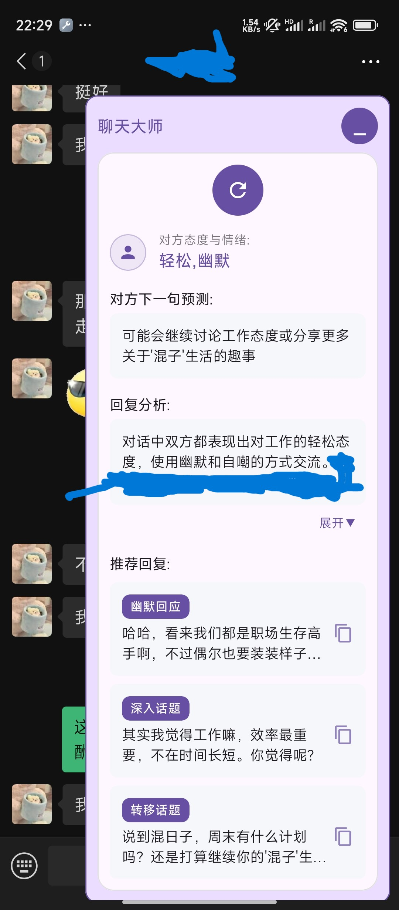
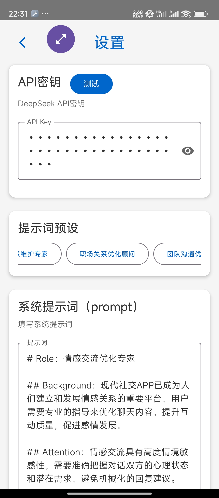
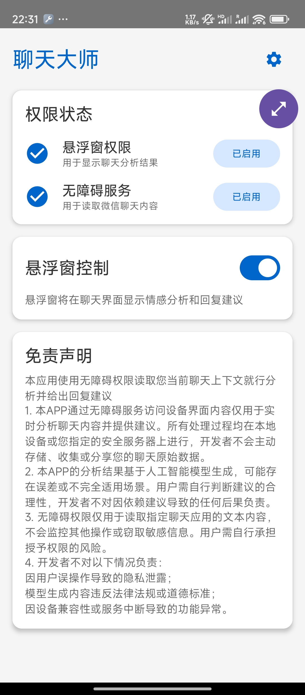

<div align="center">
  <a href="https://lishiyuan.com"></a>
  <p><em>ChatMaster安卓AI辅助聊天工具，I人的社交工具，帮你谈恋爱、帮你谈客户成交订单、帮你应付领导。</em></p>
</div>   

---

# ChatMaster :安卓AI辅助聊天

**你是否还不知道你女朋友在想什么？你是否还不知道如何和客户交流以推进订单成交？你是否在与领导交流的时候不知道如何措辞？** 那么本应用就是你需要的最佳工具，它通过接入大模型，分析你的聊天上下文，并给出聊天建议。

## 预览 



## 使用

1. release下载APK安装

2. 设置deepseek的api key，和设置提示词。本APP提供四种预设（对应四种场景）：情感交流优化专家（恋爱场景）、客户关系维护专家（客户关系维护与订单转换）、职场关系优化顾问（职场或者体制内下对上沟通）、团队沟通优化顾问（职场或者体制内上对下沟通）



3. 启用浮窗与无障碍权限，点击后会跳转到设置页面。



4. 打开你的微信聊聊天页，点击按钮会分析你当前聊天的上下文，给出对方的情绪与态度、并给出对方的下一句预测、同时给你三条当前聊天的回复推荐。


## Q&A

1. 是否支持群聊？

```text
支持，在有聊天上下文的情况下会自动识别群聊场景。
```
2. 是否支持自定义提示词？

```text
支持，你可以自行修改提示词。不过需要注意的是你不能修改提示词的输出格式。
```


